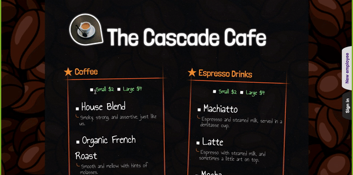

# The Cascade Cafe

## What I've Learned
Designing the layout of this app was really helpful in continuing to learn the way data flows from the frontend to the backend. It was fun figuring out how to get the voice activation running. Over all it was a fun experience. 

## Tech Stack
Made using Javascript, CSS, EJS, Node.js, Express, and user authentification with Passport.
